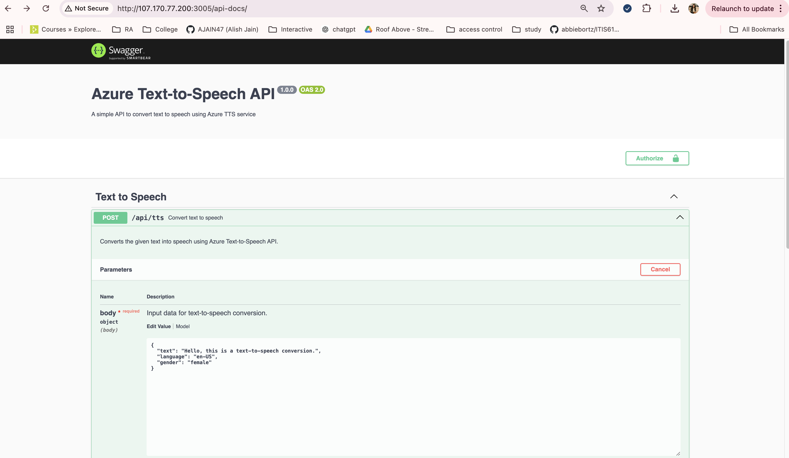
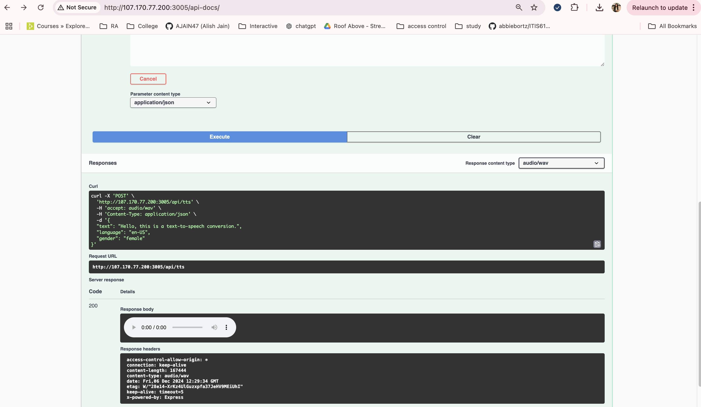
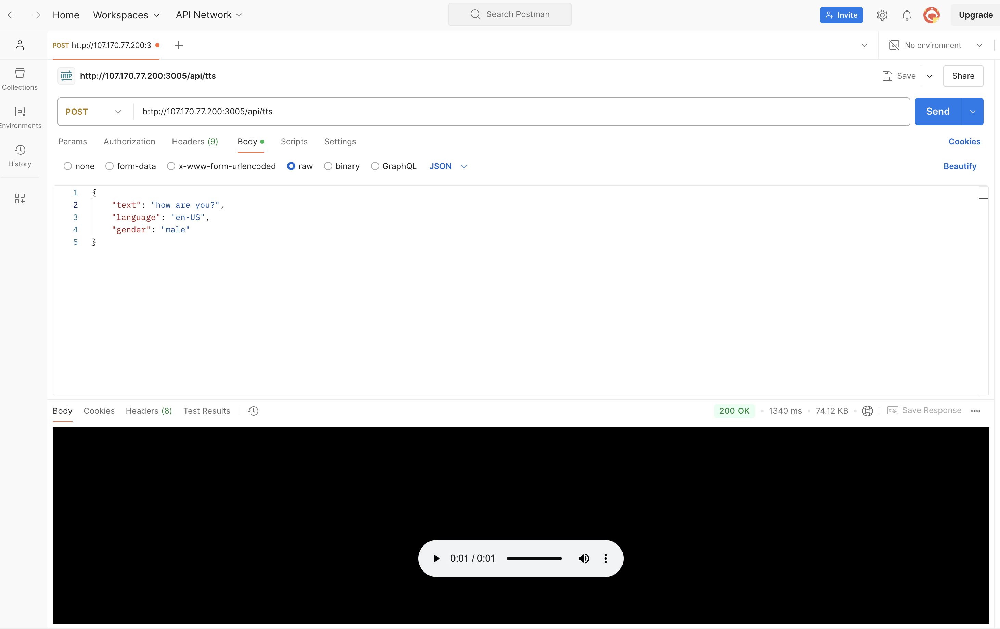
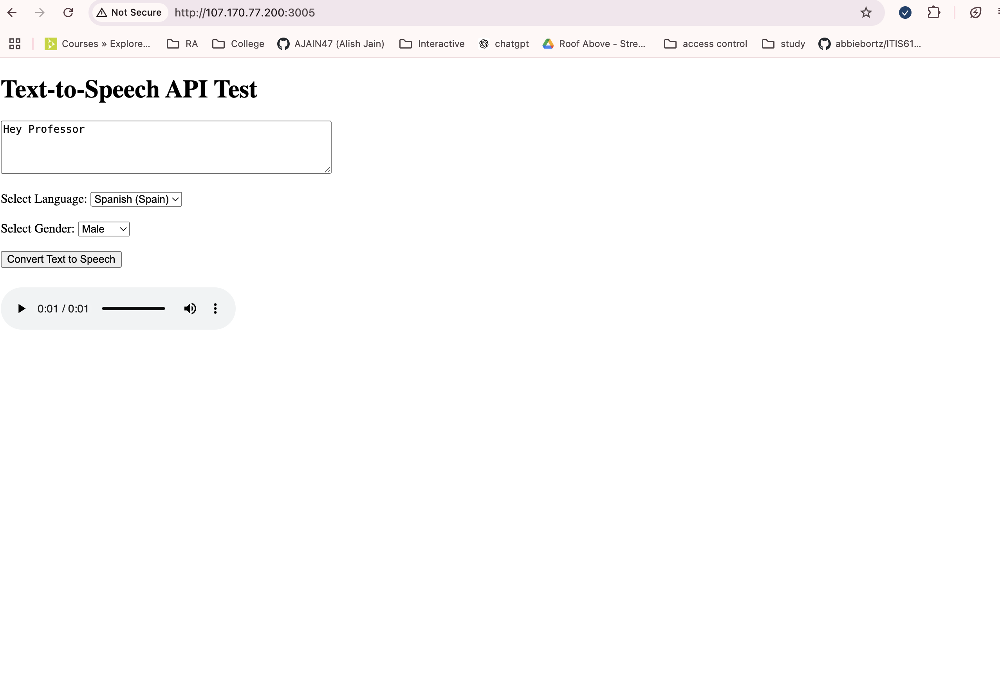

# ITIS-6177 Final Project - Azure Text-to-Speech API
System Integration (ITIS-6177) Final Project: Text-to-Speech Using Azure Cognitive Services

# Table of Contents
- [Introduction](#introduction)
- [Features](#features)
- [Technologies Used](#technologies-used)
- [System Architecture](#system-architecture)
- [Setup and Deployment](#setup-and-deployment)
  - [Azure Configuration](#azure-configuration)
  - [Installation Instructions](#installation-instructions)
  - [Local Development Setup](#local-development-setup)
  - [DigitalOcean Deployment](#digitalocean-deployment)
- [Endpoints](#endpoints)
- [API Testing](#api-testing)
  - [Swagger UI](#swagger-ui)
  - [Postman Testing](#postman-testing)
- [API Troubleshooting](#api-troubleshooting)
- [Sample Requests and Responses](#sample-requests-and-responses)
- [User Interface](#user-interface)
- [Limitations](#limitations)
- [Acknowledgments](#acknowledgments)

## Introduction
This project demonstrates the integration of Azure AI Speech with a RESTful API, enabling the conversion of text to speech in real-time. The API is designed to provide a simple and efficient interface for converting text into audio for applications that require voice synthesis capabilities.

With support for multiple languages and voices, this project ensures high-quality, natural-sounding audio outputs.

## Features
- Multi-language support with authentic accents.
- Male and female voice synthesis options.
- Real-time speech synthesis using Azure AI.
- RESTful endpoints for seamless integration.
- Easy testing with Postman and Swagger UI.
- Simple front-end interface for demonstration.

## Technologies Used
- Azure Cognitive Services: For speech synthesis.
- Node.js: Backend server.
- Express.js: API development framework.
- Axios: HTTP client for Azure API calls.
- Swagger UI: Interactive API documentation.
- Postman: For testing API endpoints.
- HTML/CSS/JavaScript: Basic front-end for API demonstration.

## System Architecture
The system follows a simple flow where:

- **Client**: Sends a request with text and configuration (language, voice, gender).
- **API**: Validates the request and forwards it to Azure AI Speech API.
- **Azure AI**: Processes the text and generates a speech response.
- **Response**: The API returns the audio file in WAV format.

## Setup and Deployment

### Azure Configuration
To set up Azure AI Speech for this project:

1. **Create an Azure Account**: Sign up at [Azure Portal](https://portal.azure.com).
2. **Create a Speech Service**:
   - Navigate to the Azure Portal.
   - Select Create a resource > AI + Machine Learning > Speech.
   - Configure resource group, name, and region.
   - Choose a pricing tier.
3. **Get Your API Key and Endpoint**:
   - Go to the Speech resource.
   - Navigate to Keys and Endpoint.
   - Copy the API Key and Region-specific Endpoint.
4. **Enable Required Features**: Ensure the Speech service is configured for text-to-speech.

### Installation Instructions

**Prerequisites**
Ensure you have the following installed:
- [Node.js](https://nodejs.org/)
- [npm](https://www.npmjs.com/)

### Local Development Setup
To set up the API on your local machine:

1. Clone this repository:
   ```bash
   git clone https://github.com/AJAIN47/azure-tts-api

2. Install dependencies:
    npm install

3. Create an .env file with the following:
    AZURE_API_KEY=<Your Azure API Key>
    AZURE_REGION=<Your Azure Region>
    PORT=3005

4. Start the server:
    npm start

5. If you want to also run the client side browser code, replace the below line of code in index.html - 
- await fetch('http://107.170.77.200:3005/api/tts') **replace it with** await fetch('http://localhost:3005/api/tts')

### DigitalOcean Deployment

To deploy the app on DigitalOcean, follow these steps:

1. **Create a Droplet**:
   - Log in to your [DigitalOcean account](https://www.digitalocean.com/).
   - Click on the **Create** button in the top right corner and select **Droplets**.
   - Choose an image (e.g., **Ubuntu 20.04**), and select the size of your droplet (the **Basic plan** with 1GB RAM should be enough for small projects).
   - Choose a data center region closest to your target audience.
   - Select **SSH keys** for authentication (or choose **Password** if you prefer to use a password for login).
   - Click **Create Droplet**.

2. **Access the Droplet**:
   - Once the droplet is created, go to your DigitalOcean dashboard and note the **IP address** of your droplet.
   - Use SSH to access your droplet:
     ```bash
     ssh root@<your_droplet_ip>
     ```
     If you're using an SSH key, specify the key with:
     ```bash
     ssh -i /path/to/your/private_key root@<your_droplet_ip>
     ```

3. **Update Your Droplet**:
   - After logging into your droplet, update the package list and install updates:
     ```bash
     sudo apt update && sudo apt upgrade -y
     ```

4. **Install Node.js and npm**:
   - Install Node.js (replace `16.x` with the required version):
     ```bash
     curl -fsSL https://deb.nodesource.com/setup_16.x | sudo -E bash -
     sudo apt install -y nodejs
     ```
   - Verify the installation:
     ```bash
     node -v
     npm -v
     ```

5. **Clone Your Project**:
   - Navigate to the directory where you want to store your project:
     ```bash
     cd /var/www
     ```
   - Clone the repository:
     ```bash
     git clone https://github.com/AJAIN47/azure-tts-api.git
     cd azure-tts-api
     ```

6. **Install Project Dependencies**:
   - Inside your project folder, install the required dependencies:
     ```bash
     npm install
     ```

7. **Set Up Environment Variables**:
   - Create a `.env` file in your project directory:
     ```bash
     touch .env
     ```
   - Add your Azure API Key, Region, and Port:
     ```bash
     AZURE_API_KEY=<Your Azure API Key>
     AZURE_REGION=<Your Azure Region>
     PORT=3005
     ```

8. **Start the Application**:
   - Run your Node.js app:
     ```bash
     npm start
     ```
   - Your app should now be running on port 3005, and you can access it via the droplet's IP address:
     ```bash
     http://<your_droplet_ip>:3005
     ```

9. **(Optional) Set Up PM2 for Production**:
   - To ensure your app runs continuously, you can use **PM2** to keep it running in the background:
     ```bash
     sudo npm install -g pm2
     pm2 start server.js
     pm2 startup
     pm2 save
     ```
   - This will ensure your app restarts automatically if the droplet reboots.

10. **Configure Firewall (Optional)**:
    - If you need to configure the firewall, you can allow traffic on port 3005 (or whatever port you’re using):
      ```bash
      sudo ufw allow 3005
      sudo ufw enable
      ```

Your application should now be deployed on DigitalOcean!

## Endpoints

| Method | Endpoint                     | Description                               |
|--------|------------------------------|-------------------------------------------|
| POST   | [/api/tts](#post-apitts) | Converts text to speech based on language and gender. |

### API Testing

#### Swagger UI
Interactive API documentation is available at: [Swagger Documentation](http://107.170.77.200:3005/api-docs/).




#### Postman Testing
1. Open Postman.

2. Create a **POST** request with the endpoint: `http://107.170.77.200:3005/api/tts`.

3. In the body (raw, JSON format), provide the text, language, and gender to convert:
   ```json
   {
    "text": "how are you?",
    "language": "en-US",
    "gender": "male"
    }
- **text**: The text you want to convert to speech.
- **language**: The language of the speech (e.g., "en" for English, "es" for Spanish).
- **gender**: The gender of the voice (e.g., "male", "female").

4. Send the request. Save the response as an audio file.

## API Troubleshooting

If you're encountering issues while using the API, here are some common solutions:
- **401 Unauthorized Error**: Ensure your API Key is correctly set in your `.env` file.
- **404 Not Found**: Double-check that you have the correct endpoint URL.
- **500 Server Error**: If this persists, check the server logs for more details.

For further assistance, refer to [Azure Cognitive Services Documentation](https://learn.microsoft.com/en-us/azure/ai-services/speech-service/rest-text-to-speech?tabs=streaming).

## Sample Requests and Responses

Here is an example screenshot of the Postman API in action:



The response will be an audio file containing the speech generated from the input text.
I have pushed a sample audio file in the git repo, feel free to check it out, the file will be named **Alish_output_sample.wav**

## User Interface

A simple web UI is available for testing the API:

- Navigate to [http://107.170.77.200:3005/](http://107.170.77.200:3005/).
- Enter the text to convert, choose a language, and select the voice gender.
- Click **Convert Text to Speech** to generate audio. Play the audio directly in the browser.



## Limitations

- Limited to languages and voices supported by Azure Cognitive Services.
- API call limits depend on the Azure subscription plan.
- Swagger UI does not natively support audio playback.

## Acknowledgments

This project was made possible with:

- [Azure Cognitive Services](https://azure.microsoft.com/en-us/services/cognitive-services/) for speech synthesis.
- The **UNC Charlotte ITIS-6177** course for guidance and inspiration.
- Open-source tools and frameworks that made development seamless.
